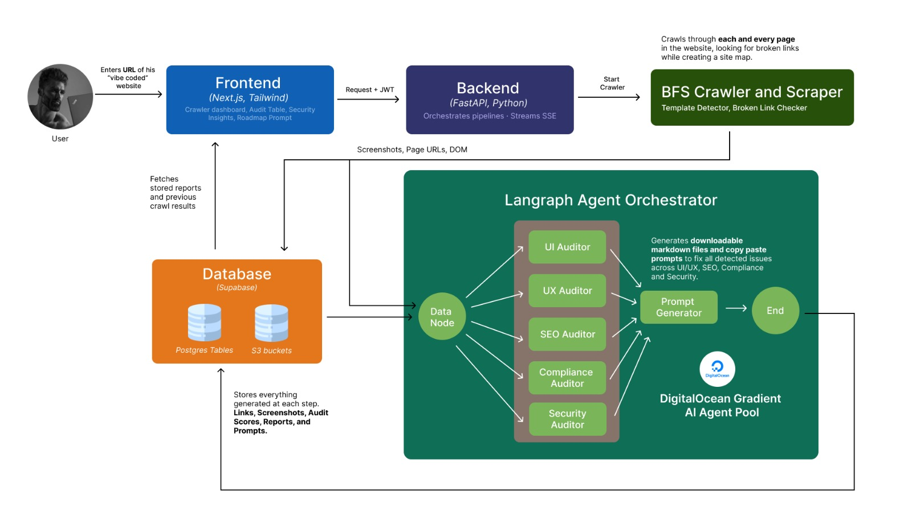

# Scout.ai

> **AI-powered website auditing platform** — paste a URL, and five specialized AI agents crawl every page and deliver structured, actionable reports on UI, UX, SEO, Compliance, and Security in under 60 seconds.

---

## Table of Contents

- [Overview](#overview)
- [Key Features](#key-features)
- [Architecture](#architecture)
- [Tech Stack](#tech-stack)
- [Project Structure](#project-structure)
- [Prerequisites](#prerequisites)
- [Installation](#installation)
- [Environment Variables](#environment-variables)
- [Running the App](#running-the-app)
- [API Endpoints](#api-endpoints)
- [AI Agents](#ai-agents)
- [Phased Fix Prompts](#phased-fix-prompts)
- [Database Schema](#database-schema)
- [Demo Site](#demo-site)
- [Test Credentials](#test-credentials)
- [Roadmap](#roadmap)

---

## Overview

Scout.ai audits any public website through a multi-agent pipeline built on **LangGraph**. You submit a URL; five parallel AI specialists — each backed by a different model — examine the page and stream structured reports back to your browser in real-time via Server-Sent Events (SSE).

For multi-page sites, a BFS crawler visits every reachable page, deduplicates template pages (e.g. `/blog/:slug`), checks every internal and external link for health, and feeds representative pages into the per-page audit pipeline. After all pages are analysed, Scout automatically generates a **phased fix roadmap** of copy-paste-ready prompts formatted for AI coding agents (Cursor, Copilot, etc.).

---

## Key Features

| Feature | Description |
|---|---|
| **Single-page audit** | Full UI + UX + SEO + Compliance + Security audit of one URL in one request |
| **Full-site crawl** | BFS async crawler with Playwright — respects `robots.txt`, skips binary files, caps depth/breadth |
| **Template deduplication** | URL-pattern + DOM-hash fingerprinting prevents auditing the same layout hundreds of times |
| **Broken-link checker** | Async `httpx` HEAD requests across every discovered link |
| **Live SSE streaming** | Results stream to the browser as each agent finishes — no polling |
| **Visual site graph** | Interactive force-directed graph (`react-force-graph-2d`) showing the crawled page tree |
| **Security scanning** | Passive header/cookie/CSP/XSS surface analysis; site-wide + per-page modes |
| **Phased AI fix prompts** | Deterministically assembled, phase-ordered prompts ready to paste into your AI coding agent |
| **Supabase auth** | JWT-validated sessions; audit history persisted per user |
| **Demo site** | Built-in multi-page demo at `demo/` for local testing with no external dependencies |

---

## Architecture

```
Browser (Next.js 16)
  │
  │  POST /audit          ← single-page
  │  POST /crawl          ← full-site crawl (SSE)
  │  POST /audit/site     ← multi-page agent pipeline (SSE)
  │  POST /audit/security ← site-wide passive security scan (SSE)
  │  POST /audit/prompts  ← phased fix prompt generation
  ▼
FastAPI  +  LangGraph
  ├── scrape_node          (Playwright + screenshot)
  ├── ui_auditor           (Gemini 2.5 Flash — vision model)
  ├── ux_auditor           (Llama 3.3 70B via Gradient)
  ├── seo_auditor          (Llama 3.3 70B via Gradient + httpx HTML fetch)
  ├── compliance_auditor   (Llama 3.3 70B via Gradient)
  └── security_auditor     (passive scanner — no LLM)
  │
  ├── crawler/
  │     ├── BFSCrawler          (asyncio.Semaphore, concurrent Playwright contexts)
  │     ├── TemplateDetector    (URL-pattern normalisation + DOM hash)
  │     ├── BrokenLinkChecker   (httpx async HEAD)
  │     └── CrawlDB             (Supabase PostgreSQL)
  │
  └── prompt_generator.py      (deterministic, zero LLM calls)
  │
Supabase PostgreSQL
  └── crawl_sessions / crawled_pages / crawled_links / template_patterns
      audit_results / user profiles
```

### LangGraph fan-out

The single-page audit graph fans out to all five agents in parallel after the scrape node completes, then merges results:

```
scrape ──┬──► ui_auditor ──────┐
         ├──► ux_auditor ──────┤
         ├──► compliance ──────┼──► merge ──► END
         ├──► seo_auditor ─────┤
         └──► security_auditor ┘
```

---

## Tech Stack

### Backend
| Layer | Technology |
|---|---|
| API framework | FastAPI |
| AI orchestration | LangGraph (`langgraph`) + `langchain-core` |
| UI/Vision agent | Google Gemini 2.5 Flash (`google-genai`) |
| UX / SEO / Compliance | Llama 3.3 70B via Gradient (`gradient`) |
| Browser automation | Playwright (async) |
| HTML parsing | BeautifulSoup4 |
| HTTP client | httpx (async) |
| Auth | Supabase JWT (`PyJWT`, `supabase` SDK) |
| Runtime | Python 3.11+ / `uvicorn` |

### Frontend
| Layer | Technology |
|---|---|
| Framework | Next.js 16 (App Router) |
| Language | TypeScript 5 |
| Styling | Tailwind CSS v4 |
| Auth | `@supabase/ssr` + `@supabase/supabase-js` |
| Graph visualisation | `react-force-graph-2d` |
| Markdown rendering | `react-markdown` |

---

## Project Structure

```
scout-ai/
├── backend/
│   ├── main.py                  # FastAPI app, LangGraph graphs, all endpoints
│   ├── auth.py                  # JWT validation (Supabase)
│   ├── prompt_generator.py      # Phased fix prompt assembly (no LLM)
│   ├── requirements.txt
│   ├── agents/
│   │   ├── ui_agent.py          # Gemini 2.5 Flash — layout, typography, colour
│   │   ├── ux_agent.py          # Llama 3.3 70B — navigation, accessibility, friction
│   │   ├── seo_agent.py         # Llama 3.3 70B — meta, crawlability, intent
│   │   ├── compliance_agent.py  # Llama 3.3 70B — GDPR, CCPA, WCAG
│   │   └── security_agent.py    # Passive scanner — headers, CSP, cookies, XSS
│   ├── crawler/
│   │   ├── bfs_crawler.py       # Async BFS with Playwright + robots.txt support
│   │   ├── broken_link_checker.py
│   │   ├── template_detector.py # URL-pattern + DOM-hash deduplication
│   │   └── db.py                # Supabase DB helpers
│   ├── tools/
│   │   ├── seo_scraper.py       # Raw HTML fetch + SEO element extraction
│   │   ├── vision_scraper.py    # Playwright screenshot + DOM capture
│   │   └── security_scanner.py  # Passive HTTP header/CSP/cookie scanner
│   └── supabase_migrations/     # Idempotent SQL migrations (phases 3–7)
├── frontend/
│   ├── app/
│   │   ├── page.tsx             # Landing page
│   │   ├── dashboard/           # Project dashboard
│   │   ├── crawl/               # Live crawl view
│   │   └── analysis/            # Single-page audit view
│   ├── components/
│   │   ├── nonprimitive/
│   │   │   ├── AnalysisDashboard.tsx
│   │   │   ├── CrawlerDashboard.tsx
│   │   │   ├── CrawlLiveFeed.tsx
│   │   │   ├── CrawlNodeGraph.tsx
│   │   │   ├── PhasedPrompts.tsx      # Fix roadmap UI
│   │   │   ├── SecurityAuditResults.tsx
│   │   │   └── SiteAuditResults.tsx
│   │   └── primitive/
│   │       └── Button.tsx
│   ├── hooks/
│   │   ├── useAuditStream.ts          # SSE hook — single-page audit
│   │   ├── useCrawlStream.ts          # SSE hook — BFS crawl
│   │   ├── useSiteAuditStream.ts      # SSE hook — multi-page audit
│   │   └── useSecurityAudit.ts
│   ├── middleware.ts                  # Supabase session guard
│   └── lib/supabase/                  # Client + server Supabase helpers
└── demo/
    ├── server.py                      # Simple Python HTTP server
    └── index.html + sub-pages         # Multi-page demo site for local testing
```

---

## Prerequisites

- **Python** 3.11+
- **Node.js** 18+ and `npm`
- **Playwright** browsers (`playwright install chromium`)
- A **Supabase** project (free tier is fine) — or skip for development without auth/DB
- A **Google AI** API key (Gemini 2.5 Flash) — [aistudio.google.com](https://aistudio.google.com)
- A **Gradient** API key (Llama 3.3 70B) — [gradient.ai](https://gradient.ai)

---

## Installation

### 1. Clone the repository

```bash
git clone https://github.com/code-Harsh247/scout-ai.git
cd scout-ai
```

### 2. Backend setup

```bash
cd backend
python -m venv .venv
source .venv/bin/activate        # Windows: .venv\Scripts\activate
pip install -r requirements.txt
playwright install chromium
```

### 3. Frontend setup

```bash
cd ../frontend
npm install
```

---

## Environment Variables

### Backend — `backend/.env`

```env
# Google AI (Gemini — UI agent)
GOOGLE_API_KEY=your_google_ai_api_key

# Gradient (Llama 3.3 70B — UX / SEO / Compliance agents)
GRADIENT_ACCESS_TOKEN=your_gradient_access_token

# Supabase (optional — omit to run without auth/DB)
SUPABASE_URL=https://your-project.supabase.co
SUPABASE_SERVICE_KEY=your_service_role_key
```

### Frontend — `frontend/.env.local`

```env
NEXT_PUBLIC_SUPABASE_URL=https://your-project.supabase.co
NEXT_PUBLIC_SUPABASE_ANON_KEY=your_anon_key

# Backend URL
NEXT_PUBLIC_API_URL=http://localhost:8000
```

> **Note:** The app runs in degraded (no-auth, no-persistence) mode when Supabase credentials are absent — useful for local development and demos.

---

## Running the App

### Start the backend

```bash
cd backend
source .venv/bin/activate
uvicorn main:app --reload --port 8000
```

### Start the frontend

```bash
cd frontend
npm run dev
# → http://localhost:3000
```

### (Optional) Start the demo site

```bash
cd demo
python server.py   # → http://localhost:8080
```

Use `http://localhost:8080` as the target URL to test Scout.ai without needing a live external site.

---

## API Endpoints

| Method | Path | Description |
|---|---|---|
| `POST` | `/audit` | **Single-page audit** — streams SSE events as each agent finishes |
| `POST` | `/crawl` | **BFS crawl** — streams `page_visited`, `page_skipped`, `crawl_complete` events |
| `POST` | `/audit/site` | **Multi-page audit** — crawls then audits representative pages; streams per-page results |
| `POST` | `/audit/security` | **Site-wide security scan** — passive header/CSP/cookie scan across all crawled pages |
| `POST` | `/audit/prompts` | **Phased fix prompts** — non-streaming; returns 1–6 phase objects with copy-paste prompts |

### Request bodies

**`POST /audit`**
```json
{ "url": "https://example.com" }
```

**`POST /crawl`**
```json
{
  "url": "https://example.com",
  "options": { "max_depth": 3, "max_pages": 50 }
}
```

**`POST /audit/prompts`**
```json
{
  "site_url": "https://example.com",
  "pages": [ ...per-page audit result objects... ]
}
```

### SSE event types

| Event `type` | When fired |
|---|---|
| `status` | Progress updates (e.g. `"Scraping page..."`) |
| `result` | Single-page audit complete — contains all five reports |
| `page_visited` | Crawler visited a page |
| `page_skipped` | Crawler skipped a template duplicate |
| `link_checked` | Broken-link health-check result |
| `crawl_complete` | Crawl finished — summary stats |
| `page_audit_result` | Per-page audit finished (site audit mode) |
| `site_security_update` | Incremental security findings |
| `site_audit_complete` | All pages audited — includes phased prompts |
| `error` | Any pipeline error |

---

## AI Agents

### 1 — UI Agent (`Gemini 2.5 Flash`)
Analyses layout, spacing, typography, colour coherence, and responsiveness from a **live screenshot** plus DOM. Returns `overall_score` (1–10) and per-category sub-scores.

### 2 — UX Agent (`Llama 3.3 70B`)
Evaluates navigation IA, accessibility signals, onboarding friction, and inclusivity from the rendered DOM. Returns `overall_score` and actionable `recommendations[]`.

### 3 — SEO Agent (`Llama 3.3 70B`)
Checks HTTPS redirect, meta description, crawlability delta (raw HTML vs rendered DOM), content quality, mobile optimisation, search intent alignment, and competitor gaps. Returns `overall_score` (1–10).

### 4 — Compliance Agent (`Llama 3.3 70B`)
Scans for GDPR/CCPA signals, cookie consent banners, privacy policy presence, WCAG accessibility compliance, and legal transparency. Returns `overall_risk_score` (1–10) and `critical_violations[]`.

### 5 — Security Agent (passive scanner — no LLM)
Performs passive HTTP analysis: response headers (`X-Frame-Options`, `HSTS`, `CSP`, `X-Content-Type-Options`), cookie flags (`Secure`, `HttpOnly`, `SameSite`), mixed content, information disclosure, and exposed sensitive paths. Findings are severity-weighted (`critical` / `high` / `medium` / `low`) to compute `overall_score`.

---

## Phased Fix Prompts

After any audit, Scout.ai generates a **six-phase fix roadmap** from the structured report data — no extra LLM call needed.

| Phase | Domain | Priority |
|---|---|---|
| **1 — Critical Fixes** | Cross-agent critical/high issues | Highest |
| **2 — Security** | Headers, CSP, cookies | Critical |
| **3 — Compliance** | GDPR, CCPA, WCAG | High |
| **4 — SEO** | Titles, meta, structured data | High |
| **5 — UX** | Navigation, accessibility, friction | Medium |
| **6 — UI Polish** | Layout, typography, colour | Low |

Each phase card in the UI shows the issue count, a colour-coded severity indicator, and the full ready-to-paste prompt. The prompt:
- Identifies the exact issues to fix with page/template context
- Explicitly states what must **not** be changed (prevents cascading breakage)
- Suggests a commit message per phase

For multi-page audits, identical issues across pages are deduplicated and annotated with `"Affects N pages"` or grouped by URL template pattern.

---

## Database Schema

Migrations live in `backend/supabase_migrations/` and are safe to run on a fresh project (all `CREATE TABLE IF NOT EXISTS`).

| Table | Purpose |
|---|---|
| `crawl_sessions` | One row per crawl job; tracks status, config, user |
| `crawled_pages` | Every visited URL with depth, DOM hash, template flag |
| `crawled_links` | All links found — status code, internal/external, final URL |
| `template_patterns` | Detected URL templates with sample counts |
| `audit_results` | Full audit report JSON per page per session |
| `profiles` | Supabase auth user profiles |

Run migrations in order:
```bash
# In your Supabase SQL editor or via CLI:
phase3.sql          # base tables
phase4_screenshots.sql
phase5_security.sql
phase6_audit_screenshots.sql
phase7_drop_profile_fk.sql
```

---

## Demo Site

`demo/` contains a self-contained multi-page website (product pages, blog posts, docs, etc.) served by a simple Python HTTP server — ideal for testing the crawler and audit pipeline without hitting external URLs.

```bash
cd demo && python server.py   # → http://localhost:8080
```

Pages included: landing, pricing, products (3 variants), blog (3 posts), docs, about, contact.

---

---

## Test Credentials

If you want to bypass the registration process and jump straight into testing Scout.ai's authenticated features, you can use the following test account. 

This account is pre-populated with sample crawl sessions and audit history so you can explore the dashboard immediately.

- **Email:** `test@gmail.com`
- **Password:** `12345678`

> **Note:** Please do not change the password for this account, as it is shared publicly for demonstration purposes.

---

## Roadmap

See [ROADMAP.md](ROADMAP.md) for the full technical design doc.

**Completed phases:**
- ✅ Phase 1 — Smart BFS site crawler with live visualisation
- ✅ Phase 2 — Multi-page agent pipeline with parallel per-page audits
- ✅ Phase 3 — Supabase auth + persistent audit history
- ✅ Phase 4 — Screenshot capture + live preview panel
- ✅ Phase 5 — Passive security agent (headers, CSP, cookies)
- ✅ Phase 6 — Phased AI fix prompt generator

**Upcoming:**
- Active security checks (authenticated scan mode)
- Scheduled re-audits and regression tracking
- Slack / GitHub issue integration for findings
- Self-hosted LLM option

---

## Contributing

1. Fork the repository
2. Create a feature branch: `git checkout -b feature/your-feature`
3. Make your changes and ensure existing functionality is not broken
4. Submit a pull request against `main`

---

## License

MIT License — see [LICENSE](LICENSE) for details.
